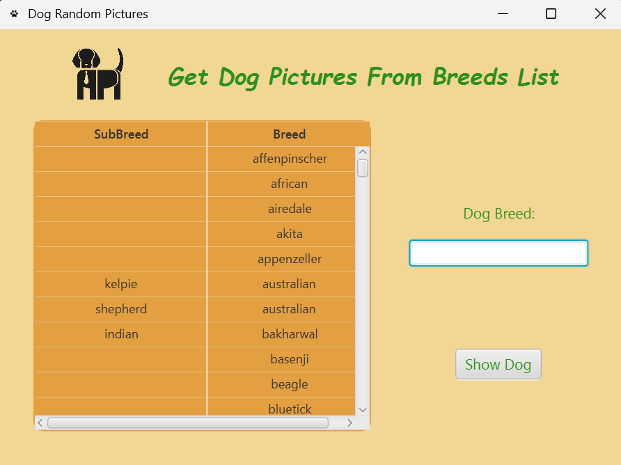
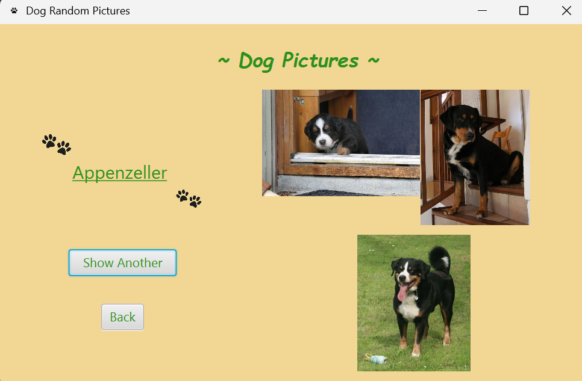

# Assignment-2-GC200605831

This JavaFX application allows users to search for dog breeds and view random images using the [Dog CEO API](https://dog.ceo/dog-api/).

- Users can search by breed or sub-breed name
- Users can also select from a table of all breeds
- View up to **3 random dog images**
- Reload images with the **"Show Another"** button

## 🐶 Breed Selection

Users can search by keyword or click a breed in the table.  
If a breed has sub-breeds, those are listed and searchable.

## 📸 Dog Random Pictures

After selecting a breed, up to **three random pictures** are shown.  
Click "Show Another" to refresh the pictures.

## 🔙 Navigation

- Click `Show Dog` to view dog pictures of the selected breed
- Click `Back` to return to the search screen

## 🎥 Demo Video
Pattern1(Choose from the list) : [here](https://go.screenpal.com/watch/cTjfeInI5uv)

Pattern2(Input the keyword in search field & Select the bleed) : [here](https://go.screenpal.com/watch/cTjfeYnI5UZ)

Patter3(If a user pushes the button without select or the keyword is wrong, errors pop out) : [here](https://go.screenpal.com/watch/cTjfetnI5vV) 
